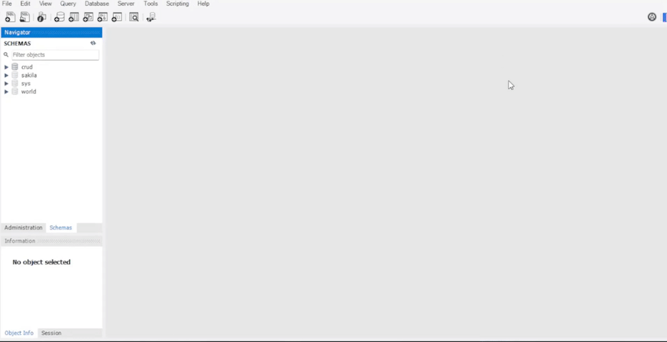

<h1 align="center">
    LOGIN AND CRUD with MySQL
</h1>
<h3 align="center"> 
  🚧  Finished  🚧
</h3>

<p align="center">
  <a href="#-pré-requisitos">Pre requisites</a>&nbsp;&nbsp;&nbsp;|&nbsp;&nbsp;&nbsp;
  <a href="#-configurando-banco-de-dados">Database</a>&nbsp;&nbsp;&nbsp;|&nbsp;&nbsp;&nbsp;
  <a href="#-bibliotecas-usadas">Libraries</a>&nbsp;&nbsp;&nbsp;|&nbsp;&nbsp;&nbsp;
  <a href="#-licença">License</a>
</p>

## 💻 Project

Project with login, registration and CRUD screen, allowing you to add new items, edit them, delete them and search bar.

  
 ### ✅ Demonstration
 <p align="center">
   
</p>


### ⚙ Pre requisites

Before starting, you will need to have the following tools installed on your machine:
[Git](https://git-scm.com), [Node.js](https://nodejs.org/en/) and/or [Yarn](https://yarnpkg.com/). 
Furthermore, it is good to have an editor to work with the code like [VSCode](https://code.visualstudio.com/) and installed [MySQl::Workbench](https://www.mysql.com/products/workbench/).


### 🔧 Configuring Database
 <p align="center">
  
</p>


### 📗 Running the Application (web)

```bash
📗 Installation

Client
1. $ cd client
2. $ npm install 
  or $ yarn install
3. $ npm start 
 or $ yarn start

Server
1. Change your mySQL database data server/index.js
2. $ cd server
3. $ npm rum dev
```

## 🚀 Libraries used

### Front-end
* React
* Bootstrap
### Back-end
* express
* mysql
* nodemon
* cors
* Formik
* bycrypt


### 📝 License

This project is under the MIT License.

<hr/>

Developed by Antonio Carlos Franco. 🚀📗
